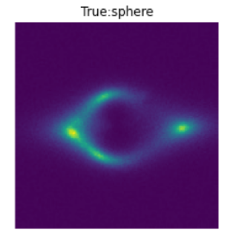
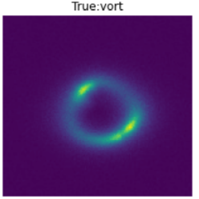
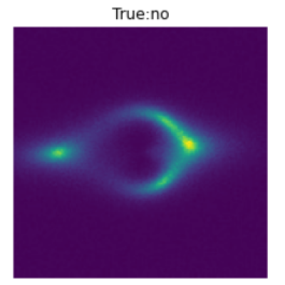
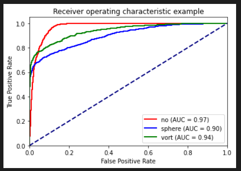

# Identifying Substructure through Multi Class Classification

## Theory

Substructures refer to smaller-scale structures that exist within larger astronomical objects, such as galaxies or galaxy clusters. In the context of dark matter, substructures are thought to be small, dense clumps of dark matter that are bound together by gravity. These clumps can range in size from less than a kiloparsec to tens of kiloparsecs, and their mass can range from a few hundred solar masses to tens of millions of solar masses.

Substructures are important to study because they can affect the way light is bent and distorted as it passes through a gravitational lensing system. By studying these distortions, astrophysicists can learn more about the properties of dark matter and the distribution of matter in the Universe. Additionally, the presence of substructures may provide clues about the formation and evolution of galaxies and galaxy clusters.

However, substructures can be difficult to detect and study because they are typically smaller and less massive than the main object they are embedded within. Techniques such as gravitational lensing, which uses the distortion of light to map the distribution of matter in the Universe.

Strong gravitational lensing occurs when the gravitational field of a massive object, such as a galaxy or cluster of galaxies, bends the path of light from a background source, such as a quasar, creating multiple images or distorted and magnified arcs. The detailed morphology of these lensed images can reveal the presence of substructures within the lensing galaxy or cluster, such as small clumps or streams of dark matter.

In the context of identifying specific types of dark matter in simulated lensing images, a deep learning algorithm is implemented to classify substructures.In this classification approach, the simulated lensing images are used as training data to teach the deep learning algorithm how to identify different types of dark matter substructures. The algorithm can then be used to classify new lensing images and determine if they contain substructures that are consistent with the properties of a particular dark matter model.

## Aim

To identify three classes: vortex substructure, spherical subhalo substructure, and no substructure present.

  
  
  

## Approach

<ul>
<li>Dataset is divided into train and val (90:10).
<li>Initially CNN were used as it's the most commonly used architecture for image classification.
<li>After reading the research paper titled <b>Deep Learning the Morphology of Dark Matter Substructure</b>, I came to know that ResNet, VGG shows better performance on multi class classification than AlexNet with ResNet being computationally more efficient. 
<li> Initially I tried training my model on ResNet but couldn't get the desired accuracy even after running for 60 epochs.
<li> Then I used pre trained Inception model, in 60 epochs it reached 60% accuracy but then it started overfitting.
<li> I tried changing the hyper parameters but no success.
<li> Then after searching for a suitable model, I came across a Transformer model for image classification.
<li> It is the <b>Vision Transformer</b> from Hugging Face, <b>Swin Transformer</b> to be precise.
<li>In Vision Transformer, we reshape the input image x, which has dimensions H x W x C, into a sequence of flattened 2D patches x_p, where each patch has a size of P x P x C. The number of patches N is equal to the total number of non-overlapping patches that can be extracted from the original image.
<li>A learnable embedding is typically prepended to the sequence of embedded image patches. This learnable embedding is similar to the [CLS] token used in BERT, and its state at the output of the Transformer encoder serves as the final image representation.
<li> The learnable embedding is typically denoted as x_class, and it is added to the beginning of the sequence of flattened image patches. During pre-training and fine-tuning, a classification head is attached to the final output of the Transformer encoder.
<li> Overall, the combination of the Transformer encoder and the classification head enables the model to learn highly effective image representations that can be used for a wide range of image classification tasks.
<li> This approach is commonly used in computer vision tasks that use transformer-based models, such as image classification and object detection, and has been shown to be effective in capturing long-range dependencies between image patches and improving the accuracy of the model.
</ul>

### Vision Transformer(ViT) vs Swin Transformer

#### 1. Architecture:

ViT applies the transformer architecture to process images, by splitting an input image into small patches and flattening them into a 1D sequence of tokens. On the other hand, Swin Transformer uses a hierarchical architecture with multiple stages of transformers, each processing a feature map of a different resolution. This allows Swin Transformer to capture both local and global information.

#### 2. Computational Complexity:

Swin Transformer has a significantly lower computational complexity than ViT due to its hierarchical architecture. Swin Transformer's computation cost is proportional to the number of tokens, while ViT's computation cost is proportional to the square of the number of tokens.

#### 3. Performance:

While ViT achieves state-of-the-art performance on various image classification tasks, Swin Transformer has shown even better results on some benchmarks. This is likely due to Swin Transformer's ability to capture both local and global features and its lower computational cost.

#### 4.Data Augmentation:

ViT heavily relies on data augmentation techniques, such as random cropping and color jittering, to improve performance, while Swin Transformer can achieve good performance even without extensive data augmentation.

## Results

After running for 10 epochs, the modela achieved accuracy of 84% on validation data.

<h1>ROC Curve</h1>

## References

1. [Vision Transformer](https://arxiv.org/pdf/2010.11929.pdf)
2. [Swin Transformer](https://arxiv.org/pdf/2103.14030.pdf)
